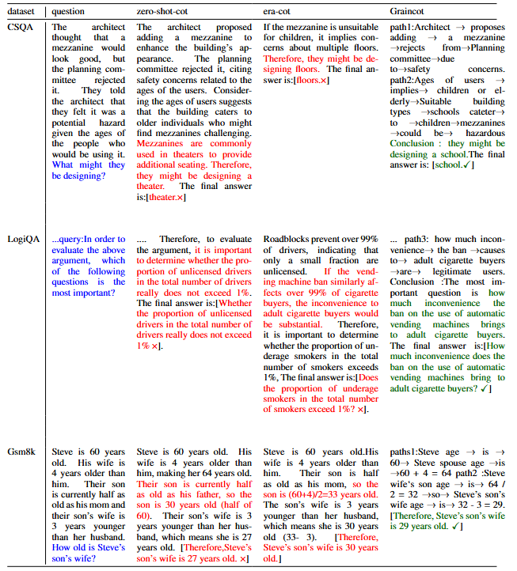

## How to Use

Update your environment for the required dependency. 

```shell
conda caeate -n your_environment_name python=3.11
```

```shell
pip install -r requirement.txt
```

1. Get your model weight on https://huggingface.co/models 
2. Locate the following configuration block in config.py and fill in your model path:
    Open config.py
    Find this section:    
    ```shell
        parser.add_argument(
        "--model_path", default='./LLM-Research/Meta-Llama-3-8B-Instruct', help="your local model path"
    )
    ```
    Replace default string with your model path
3. Run run_main.sh from the root directory:
    ```shell
    bash run_main.sh
    ```
## Case study

